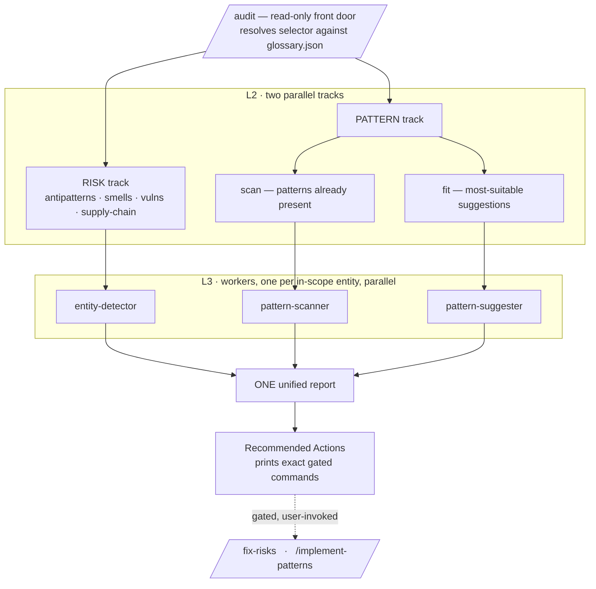

# claude-oop-excellence

<!-- REPLACE the odere-pro/claude-oop-excellence slug below with your repo if it differs. The CI badge
     tracks .github/workflows/ci.yml. The OpenSSF badges are commented out because they need a PUBLIC
     repo (Scorecard) and a registered project id (Best Practices) — see 14-supply-chain-and-governance. -->

[](https://github.com/odere-pro/claude-oop-excellence/actions/workflows/ci.yml)
[](https://docs.claude.com/en/docs/claude-code/plugins)
[](LICENSE)
[](https://docs.claude.com/en/docs/claude-code/plugins)

<!-- Uncomment once the repo is public / the project is registered (see 14-supply-chain-and-governance):
[](https://scorecard.dev/viewer/?uri=github.com/odere-pro/claude-oop-excellence)
[](https://www.bestpractices.dev/projects/REPLACE-ME)
-->

> A Claude Code plugin that **enforces good object-oriented design in any programming language** —
> audit a codebase, get one unified report, and apply gated, test-verified fixes.

It hunts God Classes, Anemic Domain Models, Feature Envy and the rest, then refactors toward sound
design with GoF patterns (Strategy, Facade, Decorator…). Around that OOP spine sits a complete
**analyze → act** pipeline: one read-only front door, one unified report, and guided changes verified
against your project's own tests. No framework, stack, or paradigm lock-in.

Two properties make it work:

- **Glossary-driven.** `skills/glossary/glossary.json` is the source of truth — **102 entities:
  45 issues** (smells, antipatterns, vulnerabilities, supply-chain risks) and **57 design patterns**.
- **Principle-based, not a per-language matrix.** Detection lives as universal design principles
  (SOLID, Law of Demeter, DRY…) plus language-neutral signs — works in any language the model can
  read. Detail in [docs/LANGUAGE-COVERAGE.md](docs/LANGUAGE-COVERAGE.md).

## Contents

- [Quick start](#quick-start)
- [How it works](#how-it-works)
- [Using `/audit`](#using-audit)
- [Commands](#commands)
- [Skills](#skills)
- [Agents](#agents)
- [Uninstall](#uninstall)

## Quick start

Install from the bundled single-plugin marketplace:

```text
/plugin marketplace add odere-pro/claude-oop-excellence
/plugin install claude-oop-excellence@odere-pro
```

Or load it locally while developing:

```bash
claude --plugin-dir /path/to/claude-oop-excellence
# then, in-session:
/reload-plugins
```

New here? Run `/onboarding` for a read-only, in-session guided tour of the mental model and the
analyze → act flow before you dive in.

Then run your first audit — it is **read-only** and never changes code:

```
/audit                 # whole project: both tracks in parallel, one unified report
/audit changed         # only files changed vs the base branch
/audit god-class       # a single entity
```

The report ends with a **Recommended Actions** section that prints the exact gated commands to run
next, scoped to what it found. Nothing is modified until you run one of those yourself.

## How it works

One front door, two parallel analysis tracks, one unified report. `/audit` is the single read-only
entry point — every layer is reachable through the same selector, and the report ends with a gated
handoff to two user-invoked commands.



The diagram is the **read-only analysis flow**. The action side is symmetrical but gated: the
`entity-fixer` and `pattern-implementer` workers (see [Agents](#agents)) run only when you invoke
[`/fix-risks` or `/implement-patterns`](#commands) yourself — Claude never refactors on its own.
Architecture deep dive in [docs/ARCHITECTURE.md](docs/ARCHITECTURE.md).

## Using `/audit`

`/audit` resolves a **selector** against the glossary and zooms across three layers —
**track → aspect → family / category / entity**:

| Selector              | Layer      | Resolves to                                               |
| --------------------- | ---------- | --------------------------------------------------------- |
| `/audit [scope]`      | L1 (full)  | **both tracks in parallel**, one unified report           |
| `/audit risks`        | L2 track   | RISK track only (alias: `/audit risk-scan`)               |
| `/audit patterns`     | L2 track   | PATTERN track — both aspects (scan + fit)                 |
| `/audit pattern-scan` | aspect     | design patterns **already present**                       |
| `/audit pattern-fit`  | aspect     | **most-suitable** pattern suggestions                     |
| `/audit <category>`   | entities   | one category (e.g. `vulnerability`, `design-pattern`)     |
| `/audit <family>`     | entities   | one family (e.g. `oop`, `security`, `behavioral`)         |
| `/audit <entity-id>`  | one entity | a single entity or pattern (e.g. `god-class`, `strategy`) |

Each selector takes an optional **scope** suffix: `full` (default), `changed` (vs the base branch),
or `component <path>` (a single subtree).

```
/audit risks                        # RISK track only
/audit patterns                     # PATTERN track: scan + fit
/audit god-class component src/     # one entity, scoped to a subtree
/audit changed                      # full run, only files changed vs the base branch
```

`oop` is the spine — it surfaces in every full audit whenever class/struct/interface declarations
are present, and it is fixed before other families.

## Commands

The two **gated commands** are what the `/audit` report's **Recommended Actions** section prints —
with real selectors and real paths — for you to run next. Both are `disable-model-invocation`
(user-invoked only), and each is a thin front door that delegates to the matching action skill:

| Command                                  | Delegates to                          | What it does                                                                                  |
| ---------------------------------------- | ------------------------------------- | --------------------------------------------------------------------------------------------- |
| `/fix-risks <selector> [scope]`          | [`/improve`](#skills) skill           | Fixes risk findings entity by entity (OOP first) via `entity-fixer`                           |
| `/implement-patterns <selector> [scope]` | [`/pattern-implement`](#skills) skill | Adopts a suggested pattern via `pattern-implementer`, through a safe parallel-change sequence |

Both run the **project's own detected** test/typecheck/lint command (e.g. `npm test`, `pytest`,
`make test`, `go test ./...`) and verify each change before moving on — there is no single-language
tooling assumption. Add `--plan-only` to either to preview the change set without writing.

## Skills

Five skills make up the user-facing surface — three for analysis and lookup, two for action:

| Skill                | Kind     | What it does                                                                                                             |
| -------------------- | -------- | ------------------------------------------------------------------------------------------------------------------------ |
| `/audit`             | analysis | The read-only analysis front door — see [Using `/audit`](#using-audit) for the selector grammar.                         |
| `/glossary`          | lookup   | Resolve any entity by id, list a family or category, or follow cross-references. Catalog: `skills/glossary/PATTERNS.md`. |
| `/onboarding`        | lookup   | In-session orientation — mental model, analyze → act flow, what to run next.                                             |
| `/improve`           | action   | The FIX action: smallest corrective refactor per issue entity. Backs `/fix-risks`.                                       |
| `/pattern-implement` | action   | The IMPLEMENT action: adopt one design pattern safely. Backs `/implement-patterns`.                                      |

The two **action** skills modify source, so like the commands that wrap them they are
`disable-model-invocation` (user-invoked only) and never auto-fire.

## Agents

Six agents do the work — one orchestrator and five generic glossary-driven workers. No per-domain
scanner files:

| Agent                 | Role                                                                                               |
| --------------------- | -------------------------------------------------------------------------------------------------- |
| `oop-orchestrator`    | Resolves the selection across both tracks and fans out workers in parallel into one unified report |
| `entity-detector`     | Detect one issue entity (read-only)                                                                |
| `pattern-scanner`     | Detect one design pattern already present (read-only)                                              |
| `pattern-suggester`   | Evaluate fit for one design pattern (read-only)                                                    |
| `entity-fixer`        | Fix one issue entity, verified with the project's own detected commands                            |
| `pattern-implementer` | Implement one pattern via a safe parallel-change sequence + tests                                  |

Adding a new entity? See [docs/EXTENDING.md](docs/EXTENDING.md) — append to the glossary, no new
agent file needed.

## Uninstall

Remove the plugin, then (optionally) drop the marketplace it came from:

```text
/plugin uninstall claude-oop-excellence@odere-pro
/plugin marketplace remove odere-pro          # optional: also forget the marketplace
```

You can also manage both from the interactive `/plugin` menu. If you loaded it locally with
`--plugin-dir`, just relaunch `claude` without that flag — there is nothing to uninstall. The plugin
ships no hooks and no MCP server, so removing it leaves no background state behind.

---

<p align="center">
  <a href="https://odere-pro.github.io/claude-oop-excellence/">Landing page</a>
  &nbsp;·&nbsp;
  <a href="LICENSE">MIT</a>
</p>
