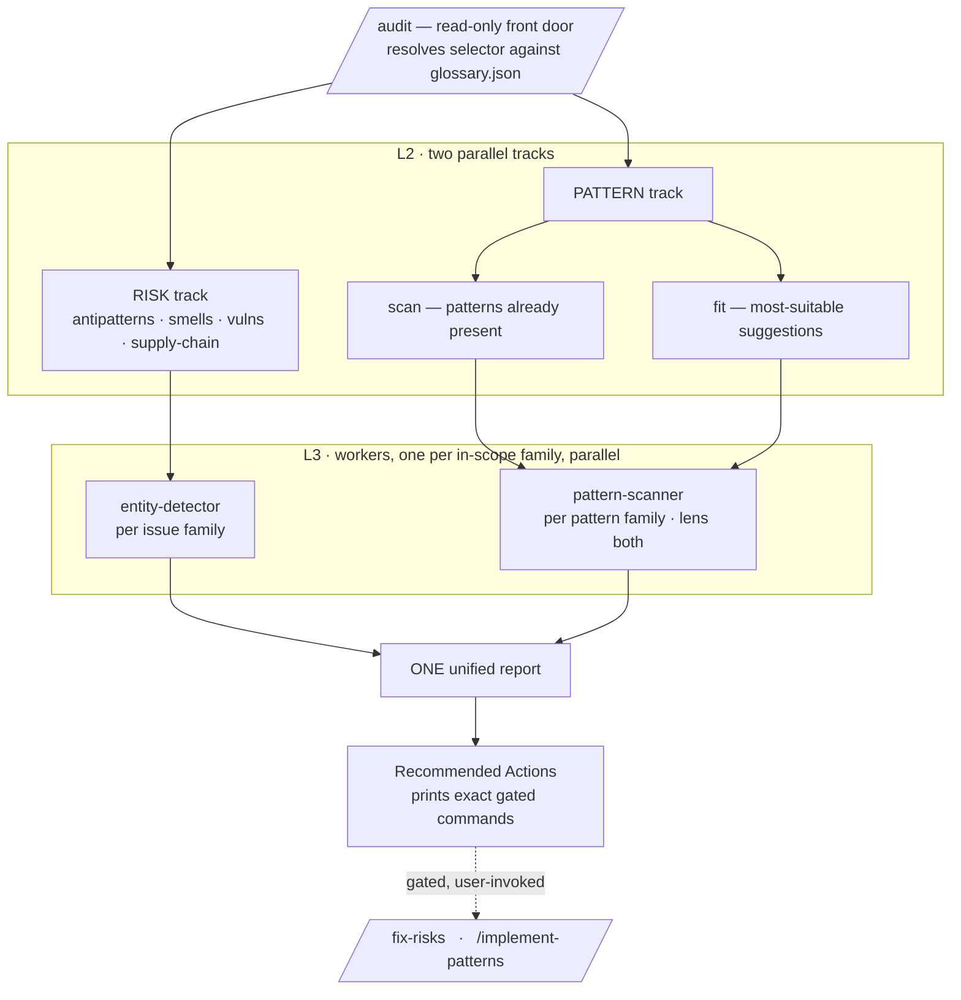

# claude-oop-excellence

[](https://github.com/odere-pro/claude-oop-excellence/actions/workflows/ci.yml)
[](https://docs.claude.com/en/docs/claude-code/plugins)
[](LICENSE)
[](https://docs.claude.com/en/docs/claude-code/plugins)

> A Claude Code plugin that **enforces good object-oriented design in any programming language** —
> audit a codebase, get one unified report, and apply gated, test-verified fixes.

It hunts God Classes, Anemic Domain Models, Feature Envy and the rest, then refactors toward sound
design with GoF patterns (Strategy, Facade, Decorator…). Around that OOP spine sits a complete
**analyze → act** pipeline: one read-only front door, one unified report, and guided changes verified
against your project's own tests. No framework, stack, or paradigm lock-in.

## What's inside

- **Glossary-driven.** `skills/glossary/glossary.json` is the source of truth — **102 entities:
  45 issues** (smells, antipatterns, vulnerabilities, supply-chain risks) and **57 design patterns**.
- **Principle-based, not a per-language matrix.** Detection lives as universal design principles
  (SOLID, Law of Demeter, DRY…) plus language-neutral signs — works in any language the model can
  read. Detail in [docs/LANGUAGE-COVERAGE.md](docs/LANGUAGE-COVERAGE.md).
- **The surface:** five skills (`/audit`, `/glossary`, `/onboarding`, `/improve`,
  `/pattern-implement`), two gated commands (`/fix-risks`, `/implement-patterns`), and six
  glossary-driven agents — all detailed under [Documentation](#documentation).

## How it works

One front door, two parallel analysis tracks, one unified report. `/audit` is the single read-only
entry point — every layer is reachable through the same selector, and the report ends with a gated
handoff to two user-invoked commands.



The diagram is the **read-only analysis flow**. Workers fan out **one per in-scope family** — each
reads the scope once and checks its whole family, so a full audit runs ≈15 family workers in parallel
rather than one per entity. In a full audit the pattern track uses a single `pattern-scanner` per
family with **lens `both`**, answering "already present?" and "would it help?" in one read;
`pattern-suggester` backs the standalone `/audit pattern-fit`. The action side is symmetrical but
gated and stays **per-entity**: the `entity-fixer` and `pattern-implementer` workers run only when you
invoke `/fix-risks` or `/implement-patterns` yourself — Claude never refactors on its own.
Architecture deep dive in [docs/ARCHITECTURE.md](docs/ARCHITECTURE.md).

## Prerequisites

Claude Code, and nothing else. The plugin ships no hooks and no MCP server, and runs as read-only
analysis until you invoke a gated action. Fixes run your project's **own detected** test / lint
command (`npm test`, `pytest`, `make test`, `go test ./...`, …), so no language-specific tooling is
assumed.

## Install

```text
/plugin marketplace add odere-pro/claude-software-3-0-marketplace
/plugin install claude-oop-excellence
```

New here? Run `/onboarding` for a read-only, in-session guided tour of the mental model and the
analyze → act flow before you dive in.

## Quickstart

Run your first audit — it is **read-only** and never changes code:

```text
/audit                 # whole project: both tracks in parallel, one unified report
/audit changed         # only files changed vs the base branch
/audit god-class       # a single entity
```

The report ends with a **Recommended Actions** section that prints the exact gated commands to run
next, scoped to what it found. Nothing is modified until you run one of those yourself.

`/audit` resolves a **selector** against the glossary and zooms across three layers —
**track → aspect → family / category / entity**:

| Selector              | Layer      | Resolves to                                               |
| --------------------- | ---------- | --------------------------------------------------------- |
| `/audit [scope]`      | L1 (full)  | **both tracks in parallel**, one unified report           |
| `/audit risks`        | L2 track   | RISK track only (alias: `/audit risk-scan`)               |
| `/audit patterns`     | L2 track   | PATTERN track — both aspects (scan + fit)                 |
| `/audit pattern-scan` | aspect     | design patterns **already present**                       |
| `/audit pattern-fit`  | aspect     | **most-suitable** pattern suggestions                     |
| `/audit <category>`   | entities   | one category (e.g. `vulnerability`, `design-pattern`)     |
| `/audit <family>`     | entities   | one family (e.g. `oop`, `security`, `behavioral`)         |
| `/audit <entity-id>`  | one entity | a single entity or pattern (e.g. `god-class`, `strategy`) |

Each selector takes an optional **scope** suffix: `full` (default), `changed` (vs the base branch),
or `component <path>` (a single subtree). `oop` is the spine — it surfaces in every full audit
whenever class/struct/interface declarations are present, and it is fixed before other families.

## Documentation

**Commands** — the two **gated commands** are what the `/audit` report's **Recommended Actions**
section prints, with real selectors and paths, for you to run next. Both are
`disable-model-invocation` (user-invoked only) and delegate to the matching action skill:

| Command                                  | Delegates to         | What it does                                                                       |
| ---------------------------------------- | -------------------- | ---------------------------------------------------------------------------------- |
| `/fix-risks <selector> [scope]`          | `/improve` skill     | Fixes risk findings entity by entity (OOP first) via `entity-fixer`                |
| `/implement-patterns <selector> [scope]` | `/pattern-implement` | Adopts a suggested pattern via `pattern-implementer`, through safe parallel change |

Both run the project's own detected test/lint command and verify each change before moving on. Add
`--plan-only` to either to preview the change set without writing.

**Skills** — five make up the user-facing surface, three for analysis/lookup and two for action (the
two action skills modify source, so they are `disable-model-invocation`):

| Skill                | Kind     | What it does                                                                        |
| -------------------- | -------- | ----------------------------------------------------------------------------------- |
| `/audit`             | analysis | The read-only analysis front door (selector grammar above).                         |
| `/glossary`          | lookup   | Resolve any entity by id, list a family or category, follow cross-references.       |
| `/onboarding`        | lookup   | In-session orientation — mental model, analyze → act flow, what to run next.        |
| `/improve`           | action   | The FIX action: smallest corrective refactor per issue entity. Backs `/fix-risks`.  |
| `/pattern-implement` | action   | The IMPLEMENT action: adopt one design pattern safely. Backs `/implement-patterns`. |

**Agents** — six do the work, one orchestrator and five generic glossary-driven workers (no
per-domain scanner files): `oop-orchestrator`, `entity-detector`, `pattern-scanner`,
`pattern-suggester`, `entity-fixer`, `pattern-implementer`.

Deep dives: [docs/ARCHITECTURE.md](docs/ARCHITECTURE.md) · extending the glossary
[docs/EXTENDING.md](docs/EXTENDING.md) · [docs/LANGUAGE-COVERAGE.md](docs/LANGUAGE-COVERAGE.md).
**Uninstall:** `/plugin uninstall claude-oop-excellence`, or manage it from the interactive `/plugin`
menu.

## Privacy

No telemetry. The plugin never phones home — it ships no hooks and no MCP server, so removing it
leaves no background state behind. Analysis runs in your session; nothing leaves your machine.

## License

MIT — Oleksandr Derechei (odere-pro). See [LICENSE](LICENSE).
